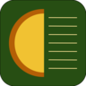

# uvext
WebExtensions browser extension to get the UV index in Australian cities.

## Install
The package.sh script should do all you need.

## Support

### Browser
Initial versions are designed for Firefox. However, minor changes are all that should be required to have this work in Chrome.

### City
| State/Territory        | City           | 
|:------------- |-------------:|
| AAT      | Casey, Davis, Macquarie Island, Mawson |
| ACT      | Canberra |
| QLD      | Brisbane, Gold Coast, Townsville |
| NT | Alice Springs, Darwin |
| NSW | Newcastle, Sydney |
| SA | Adelaide |
| TAS | Kingston |
| VIC | Melbourne |
| WA | Perth |

## Chrome/Chromium Support
Chrom(e/ium) support is a work in progress. The focus is on Firefox but code for the Chrome version is provided and, let's say, half-workable in its current state.
